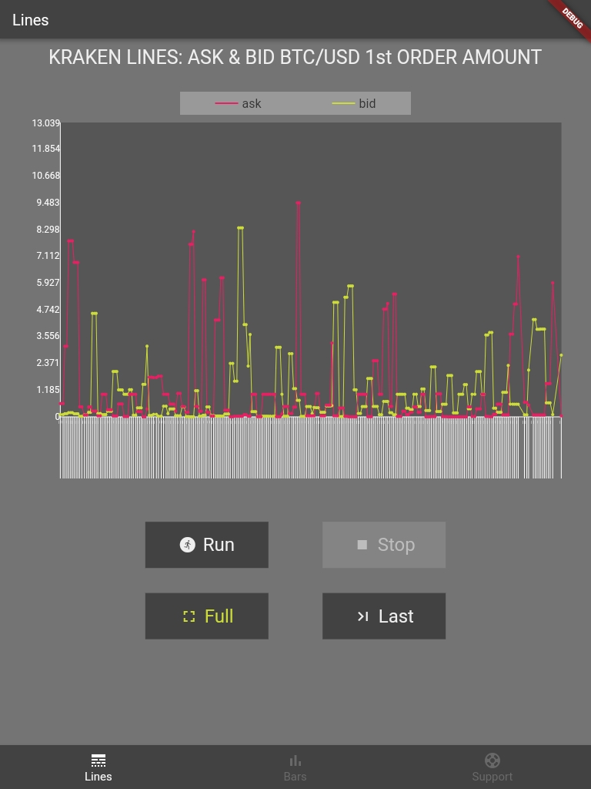
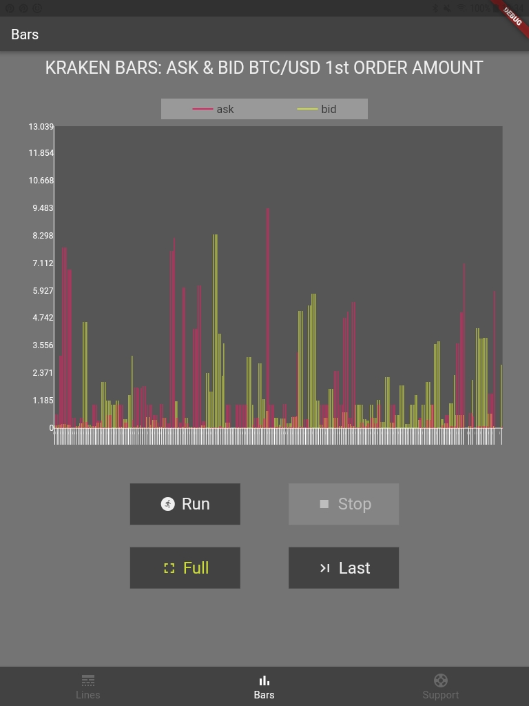

## Flutter Kraken bids/aks

Simple app which displays the amount of the first bid and ask order each in 2 seconds interval as minimun (depends the network).

The orderbook is retrieved from the public endpoints of the [Kraken Exchange](https://www.kraken.com/)

Using [Google Charts](https://github.com/google/charts) for displaying data:

<p align="center">
 
 
</p>

### How it works

1. Get flutter packages
```
chmod +x update.sh
./update.sh
```

2. First run the server
```
dart lib/server.dart
```

3. Set your server IP into **libs/lib_requests/lib.server_api.dart**

```
Line 23: String get apiUrl => 'http://192.168.1.7:4040';
```

4. Run client
```
flutter run lib/main.dart
```

### Testing

### Kraken api get orders api
```
flutter test test/kraken_api_test.dart
```

### Database test
```
flutter drive --driver integration_test/driver.dart --target integration_test/database_test.dart
```

### Licensed
GPLv3